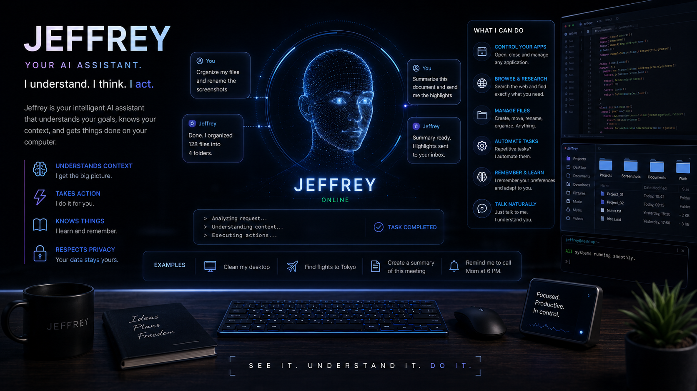

# Jeffrey



Voice first macOS agent that listens, reasons, executes system actions and answers aloud. The project explores the difference between an AI that explains and an AI that can actually operate a computer.

## What it does

Jeffrey combines speech recognition, model routing, a structured tool registry, macOS automation and spoken responses. Its tools cover app launching, keyboard and mouse control, screenshots, files, media, reminders, system settings and reusable workspace actions.

## Architecture

```text
Microphone → speech recognition → orchestrator → model
                                           ↓
macOS state ← AppleScript and Python tools ← function call
      ↓
memory → response → text to speech
```

The orchestrator owns the loop. Models only choose from explicit schemas. Tool results return structured evidence so Jeffrey can verify an action before answering.

## Stack

Python, AppleScript, Whisper compatible speech recognition, Ollama local inference, cloud model routing and native macOS voices.

## Run locally

```bash
python3 -m venv .venv
source .venv/bin/activate
pip install openai requests sounddevice numpy
python main.py
```

Provider keys are read from environment variables. Never commit them.

## Repository map

`main.py` starts the assistant. `jeffrey/orchestrator.py` manages the loop. `jeffrey/brain.py` routes reasoning. `jeffrey/tools.py` and `tools_extra.py` expose actions. `recorder.py`, `stt.py` and `tts.py` own voice I/O. `memory.py` stores bounded context.

## What I learned

For an acting agent, tool design sets the ceiling. Clear schemas, bounded side effects, strong return values and verification improved the experience more than changing models.

## CA

Jeffrey és un agent de veu per a macOS que escolta, raona, executa accions reals i respon oralment. El projecte connecta IA, automatització del sistema i interacció per veu.

## ES

Jeffrey es un agente de voz para macOS que escucha, razona, ejecuta acciones reales y responde en voz alta. El proyecto conecta IA, automatización del sistema e interacción por voz.
